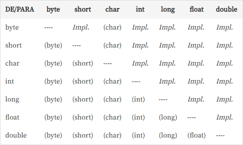
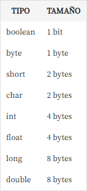

## Instructor
Diego Arguelles Rojas

GitHub https://github.com/Darguelles  
Medium https://medium.com/@darguelles.rojas91  
LinkedIn https://www.linkedin.com/in/diego-arguelles-rojas/

Using JDK 8

Install in Linux
`sudo apt-get install oracle-java9-installer`

Install in Mac
`https://www.oracle.com/java/technologies/javase-downloads.html`

Install in Windows
`https://www.oracle.com/java/technologies/javase-downloads.html`

Configure the PATH

## Run java file
* Create a file
  ```java
  public class Test {
    public static void main(String[] args) {
        System.out.println("Hello World");
    }
  }
  ```
* Build the file to bytecode
  
  `javac myfile.java`
* Run the file (doesn't need .class extension
  
  `java myfile`

## Casting & Sizes




## Inheritance

* Helps us reutilize code.
* Child classes get the attributes and methods from parent classes.
* Constructors are not inherited.
* Attributes and methods of a parent class are called using `super`
* The constructor of the parent class is used calling `super()`. If the superclass has a no-argument constructor, this happens automatically. But if the superclass has a constructor with arguments, you need to call it explicitly using super().
* Child classes can be referenced as parent classes, this is we can use more generic references to interact with the same object, which helps with decoupling.
* We use `@Override` to implement or redo a method in a parent class
* Abstract classes can have methods with bodies or not.
* Abstract classes can have private static variables.
* **Protected** variables can be accessed by child classes, even if the class is abstract.
* We can't have a class be a subclass of more than one parent class.
* Interfaces can be added to a class through the keyword `implements`. We use this to help with decoupling.
  ```java
  public class Manager extends Employee implements EmployeeLoginAble {
  }
  ```
* When composing our classes, we can add attribute classes that perform utilities such as retrieving the time
